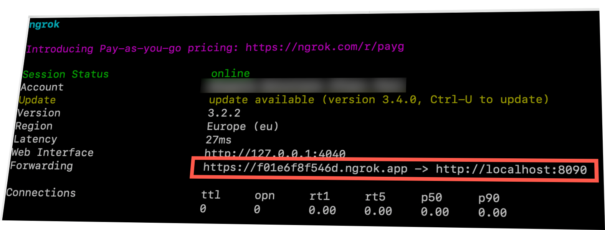
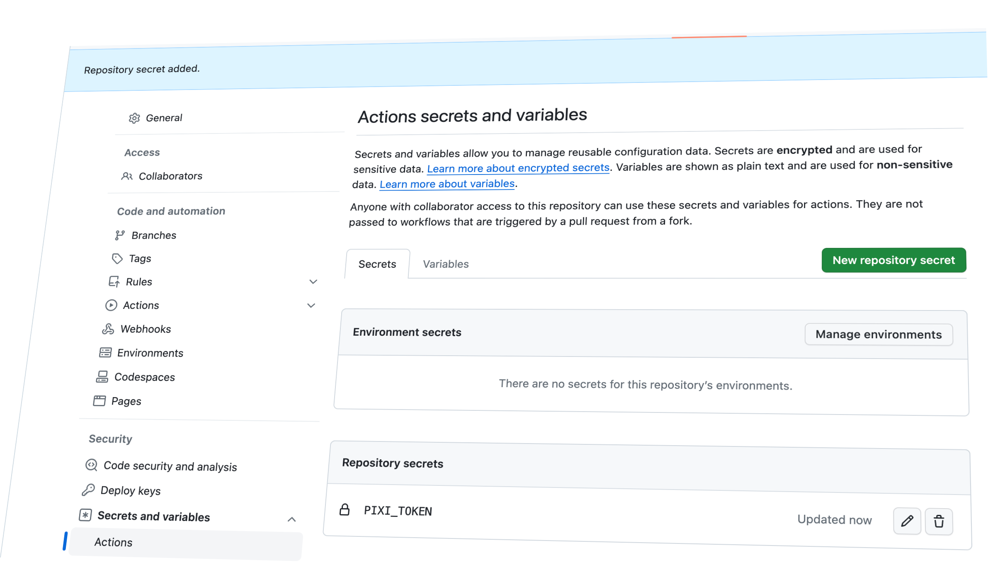

# 42Crunch Dynamic API Security Testing Tutorial

## Introduction

This tutorial will walk you through the process of testing an API using 42Crunch Scan. The tutorial will cover the following topics:

- Deploying the PhotoManager API locally
- Expose the API to the internet using ngrok
- Run the 42Crunch API Security scan against the API

## What is 42Crunch Scan?

42Crunch Scan is a dynamic API security scanner that can be used to test APIs for vulnerabilities. It leverages the API OpenAPI definition to automatically test the API for a number of issues, across authentication, authorization and improper input validation. 

42Crunch Scan also validates API responses to ensure that the API conforms to its definition and does not leak additional data or stack traces for example.

## Prerequisites

- **Docker**: Docker is a tool that allows you to run applications in containers. You can download Docker from [here](https://www.docker.com/products/docker-desktop).
- **ngrok**: NGrok is a tool that allows you to expose a local web server to the internet. You can download ngrok from [here](https://ngrok.com/download). The tool requires to register to obtain a token (for free).
- **42Crunch Freemium CI/CD Scan**: this task assumes that GitHub Advanced Security is enabled on your repository. Code Scanning can be enabled for free on public repositories and for paid accounts on private repositories. You can enable Code Scanning by following the instructions [here](https://docs.github.com/en/github/finding-security-vulnerabilities-and-errors-in-your-code/about-code-scanning#enabling-code-scanning-for-a-repository).

Note: this tutorial leverages the Freemium version of 42Crunch Scan. It is available for GitHubActions  and will be added on more CI/CD platforms in the future.

## Fork this repository

In order to follow this tutorial, you will need to fork this repository. To do this, click on the "Fork" button in the top right corner of this page.

## Deploying the PhotoManager API locally

The PhotoManager API (a.k.a Pixi) is a simple vulnerable API originally developed by OWASP, that allows users to upload and retrieve photos. The API is written in Node.JS and available as Docker images hosted on Docker Hub.

To run the API locally, execute the following command from the root of the repository you forked in the previous step:

```bash
docker compose up
```

The API will be available on port 8090.

## Expose the API to the internet using ngrok

The CI/CD task needs to be able to access the API in order to scan it. To do this, we will use ngrok to expose the API to the internet.

To expose the API, execute the following command:

```bash
ngrok http 8090
```
Note the URL that ngrok provides. This will be used in the next step.



## Configure the 42Crunch Scan task

In this tutorial, we provide you with an existing workflow that you can use to test the API. You need to adjust it so that it works in your environment.

### Obtain a credential 

T

### Create a GitHub secret 

In order to run the scan, you will need to provide an API credential. The Photo Manager API lets users register and obtain automatically a JWT token. We have provided a sample script that will obtain a token from the API.

1. Execute the scripts/register_user.sh script

```bash
sh register_user.sh
```

2. Copy the token that is returned by the script
3. Navigate to the Settings tab of your repository and click on the `Secrets and Variables` and then `Actions`
4. Click on the "New repository secret" button
5. Set the name of the secret to `PIXI_TOKEN` and paste the token as the value
6. Click on the "Add secret" button



### Configure the existing scan workflow

You now have to edit the workflow provided in this repository to adjust the target URL of your API:

1. Edit the existing workflow :  `.github/workflows/42c-scan.yaml`
2. Edit the TARGET_URL environment variable at the top of the file, and set its value with the URL provided by ngrok in the previous step (e.g. `https://12345678.ngrok.app`) plus the API base path, in the case of the PhotoManager API, `/api`. The final value should look like this: `https://12345678.ngrok.app/api`. 
3. Commit the changes and push the changes to your repository. 

```yaml
...
on:
  workflow_dispatch:
  push:
    branches: [ "main" ]
  pull_request:
    # The branches below must be a subset of the branches above
    branches: [ "main" ]  

env:
    TARGET_URL="https://your_ngrok_domain.ngrok.app/api"
jobs:
  run_42c_scan:
    permissions:
...
```

## Run the workflow

The workflow will run automatically when you commit the changes. You can also run it manually by clicking on the "Run workflow" button.

## View the results

Once the workflow has completed, you can view the results inside the Security tab of your repository, under Code Scanning Alerts. The full SARIF report is also exported as an artifact.

## Reset the database

Each time the scan runs, it creates data within the database (each time an injection is successful). To reset the database, run the following commands:

```bash
docker compose down
docker compose up
```

## Conclusion

In this tutorial, you have learnt how to use 42Crunch Scan to test an API for vulnerabilities leveraging the Freemium version of 42Crunch Scan. In the next tutorial, you can now apply what you learned to your own APIs!
